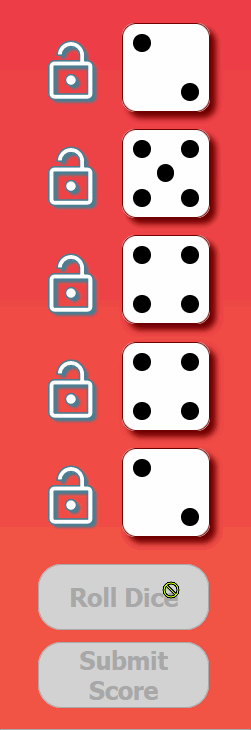
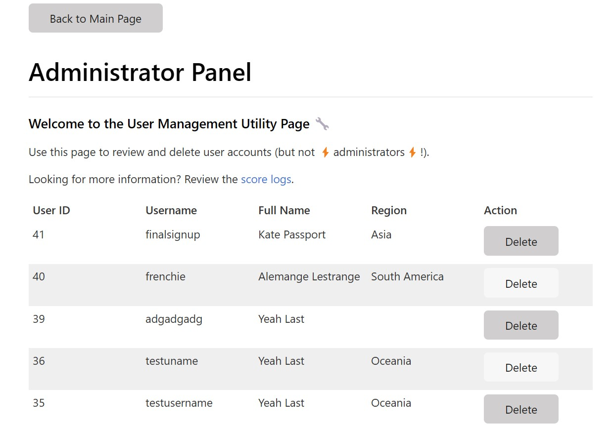
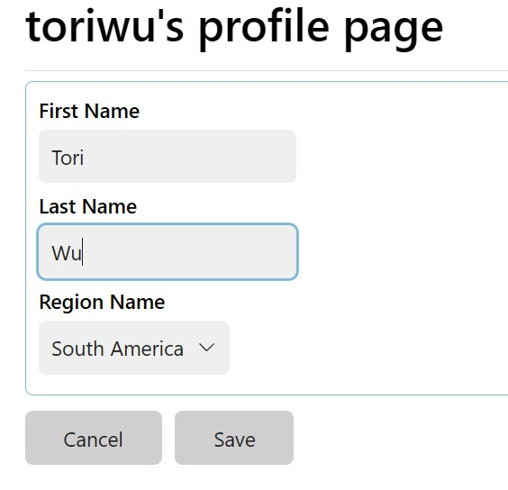
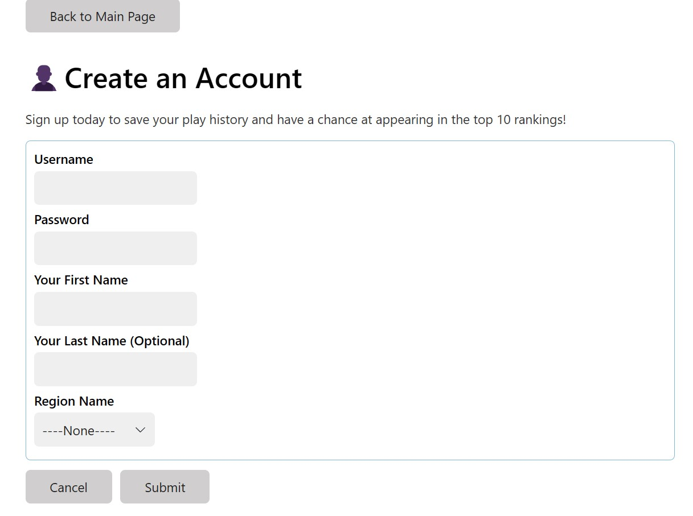
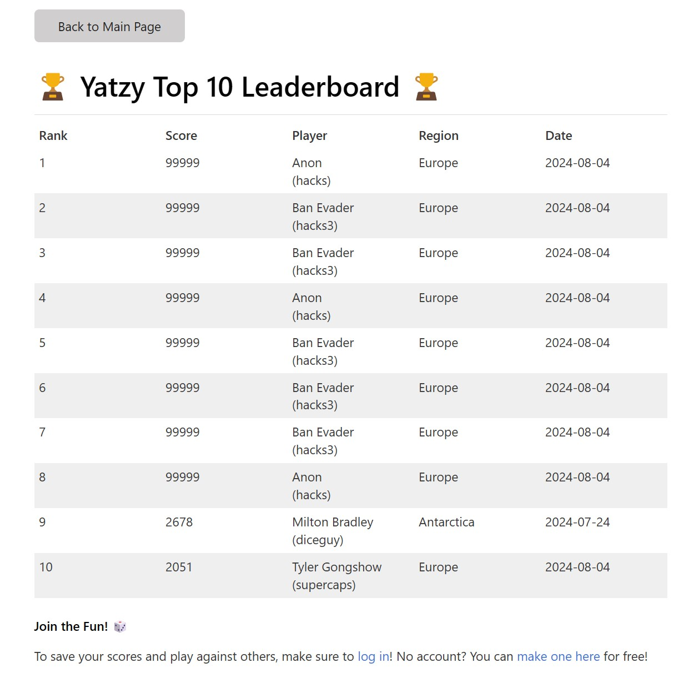

# Design System

This document outlines the design system for the project.

## Fonts

This project uses two web fonts provided for free use by Google.

- **Primary Font:** Open Sans, sans-serif
- **Logo Font:** Playwrite Polska, cursive

## Colours

- **Primary Colour:** #eb3349 (Munsell Red)
- **Primary Accent:** #f45c43 (Tomato Red)
- **Primary Dark:** #700000 (Blood Red)
- **Secondary Colour:** #5db6d7 (Aero Blue)
- **Secondary Dark:** #4a7e92 (Air Force Blue)
- **Tertiary Colour:** #ffffff (White)
- **Tertiary Accent:** #000000 (Black)

## Designing the Dice

The original, lab-design for the dice is documented in [dice.html](assets/design_system/dice.html) via document through code. It shows an example of the dice graphics used and details pertaining to their design/usage in the project.

For the final assignment, we changed to CSS-based dice making use of the colours above. Information about the final design of the dice can be found in the README.md file. However, a broad overview of dice states and functions can be found below.

### Default Dice

Dice are div objects with a predefined radius. In this state, dice contain a default presentation using the primary red colour set as an accent, and a hover state utilizing the secondary blue colour set as an accent.

Dice will display a "wiggle" CSS keyframe animation when they are rolled.

Dice selected for scoring will change their appearance to use a secondary colour scheme. They will acquire a thick border and their internal dots will shrink to 95% of their original scale.

Dice will display as "no dice" when they have not yet been rolled. In this instance, the dice have no spots and instead display a "?". They use the primary red colour scheme and gain a white dashed border. This disappears when the dice are rolled and return to their default state.

Dice which are locked will not display a "wiggle" animation when the hand is re-rolled. This is to assist the user in noticing which dice have retained their values.

## Game Components

This section provides documentation of major game components.

### Starting a new game

To start a new game, users click a button to initialize a new game. When the game is ready to play, the UI will become interactive and the "Roll Dice" button will be enabled.

### In-Game Play (Rules and Controls)

This implementation of Yatzy is a single-player 5-die game with 15 turns and 15 score slots to complete on a score card. Each turn begins with rolling a set of dice, and ends when a score is submitted. When all turns have elapsed (and the scorecard is complete), the game has ended.

Each score slot on the score card has different dice requirements for points. By making choices about how to complete the score card as turns progress, the player's goal is to get the highest score possible.

#### Turn Begin (Roll Phase)

- To roll the dice, players click a button. Clicking the button provides the player with five random dice values on the screen.
- The player can click the button again to re-roll all five dice up to two times before the button is disabled.
- The player have the option of locking and unlocking individual dice by clicking on the lock icon next to a die. Locking a die prevents its value from changing when dice are re-rolled.
- Locked dice will not play a "jiggle" animation when a re-roll occurs, to emphasize that they have not been changed.

#### Scoring Strategy (Decision Phase)

- The player can select which dice they would like to count towards a score choice by clicking on them with the cursor.
- Players must select at least one die and score category to progress a turn.
- Dice that have been selected will visually change to show they have been chosen for scoring consideration.
- Dice can be deselected by clicking on them again.

#### Score Calculation / Turn End

- After selecting at least one die, the player clicks on the score category in the score card that they would like to earn points in.
- Players can only select each category once, and so should consider carefully which dice to submit for each category to maximise their score.
- After making a selection, players click a button to submit their score. This ends the turn.
  - If this is not the final turn, a new turn begins and the player returns to the roll phase.
  - If this is the final turn, the game ends.

### Scoreboard

The interactive scoreboard shows information about the game. It keeps track of the number of points awarded per category, as well as the total number of points earned throughout the game. Each row can be completed only once per game.

The scoreboard is designed as a simple table of columns and rows, to mimic the appearance of a real paper score card.

Unlike a paper scorecard, the category row directly under the cursor will change its colour to help the user make a selection. If this row is clicked, it will darken in order to help the player remember their selection.

- The most recently-selected category will be used for scoring when a turn ends.
- The name of each score category appears under the **Category** column.
- The number of points earned per category is displayed in the **Pts** column.
- The criteria for computing score is provided in the **Description**. This information provides the player with context to help them make strategic scoring choices.

#### Bonus

- If a player has scored 63 or more points in the first six categories, at the time this threshold is met, a bonus score of 50 points is immediately added to the total.
- A message displays next to the total score in the scorecard when the bonus has been achieved.

### End of the game

- The game ends when the score card has been completed and all 15 turns.
- A pop-up appears upon submitting the final score, prompting the player to input their name.
- Upon inputting their name, the leaderboard will appear below the scoreboard.
- If the player's score is within the top 10 scores, their name, score, and rank will be displayed alongside any other entries.
- The player can begin a new game by clicking the "Start a New Game" button found next to thet logo. This will start a new game and hide the leaderboard.
- To quit the game, the player closes the browser.

### Header

The page header displays the primary logo of the game, "Yatzy", alongside a descriptive tag-line and a button to start a new game.

### Footer

A footer displays the name of our group in the primary colour. A dashed border line separates the main content from the footer.

### Game Buttons

The game buttons utilize a common design of rounded edges, the secondary blue colour set, and a drop shadow. These buttons become disabled under certain game circumstances or certain request processing conditions.

#### Locks

The locks use [Google's material icons font](https://fonts.google.com/icons). Unlocked locks use the outlined icon, while locked locks use the filled icon.

### Cursor

The cursor will change to reflect components that are interactive, or to signify that certain components have become inactive.

- The **pointer** signifies something can be clicked. This includes buttons, rows, dice, and locks.
- The **forbidden sign** signifies when buttons are disabled and cannot be clicked.
- The **default** cursor shows in all other instances.
- The **hourglass** cursor will appear when an AJAX request is processing (i.e. for ready states 1, 2, and 3), provided the cursor is not currently showing as **forbidden**.

## Designing the Leaderboard

The original leaderboard functions and features were designed in a prototype (see 'submitScore.html') and connected to a JSON API. Names were solicited via a form and 'scores" were simulated via a random number generator.

The API stores the session's top 10 scores and, if the leaderboard is full, determines whether or not a new score should be added to the board or not.

After core functionality was established, the leaderboard was integrated into the existing yatzy infrastructure as a table utilizing the same table css styling components as the scoreboard.

The player's name is solicited by a pop-up that occurs when the game ends and the final score is shown.

## Database Design

The full database design document can be found [here](db.md)

### Admin Functionalities

#### Manage Users

#### Manage Scores

### Player Functionalities

### Create Account

### New Leaderboard

