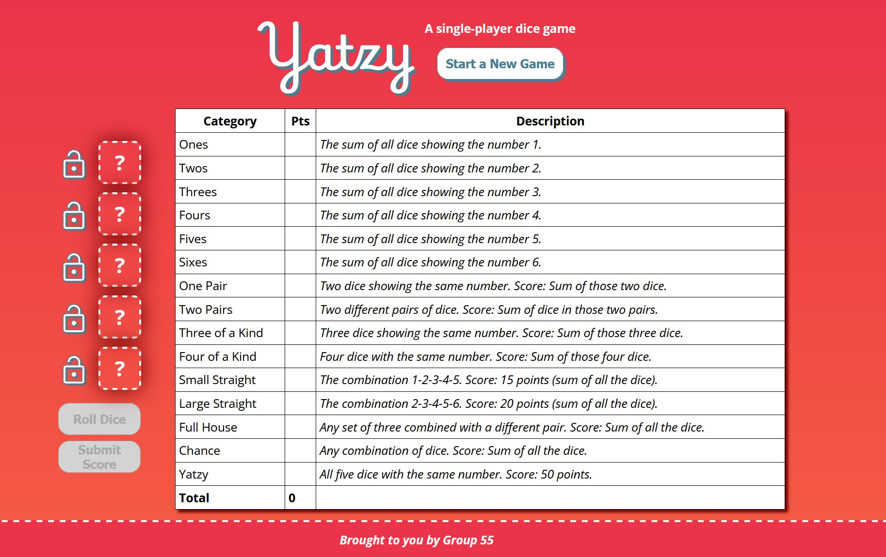
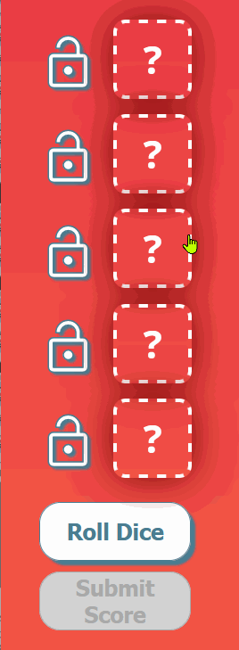
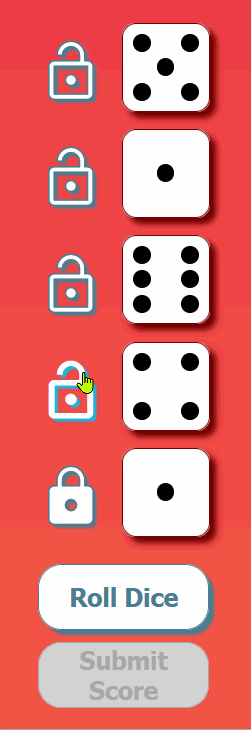
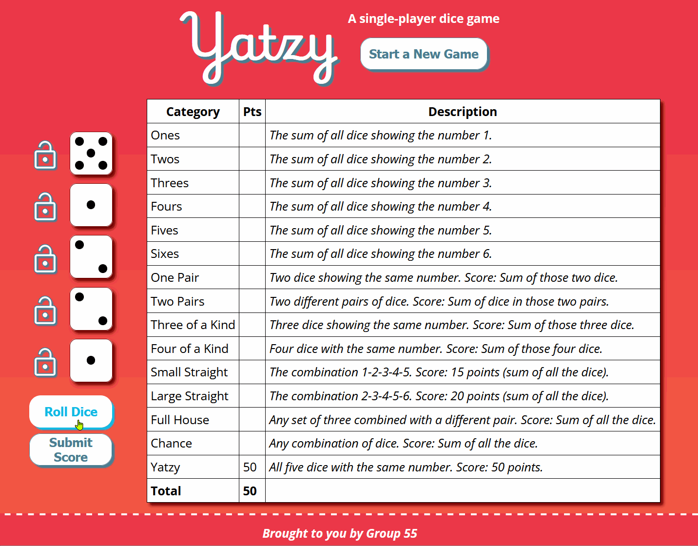
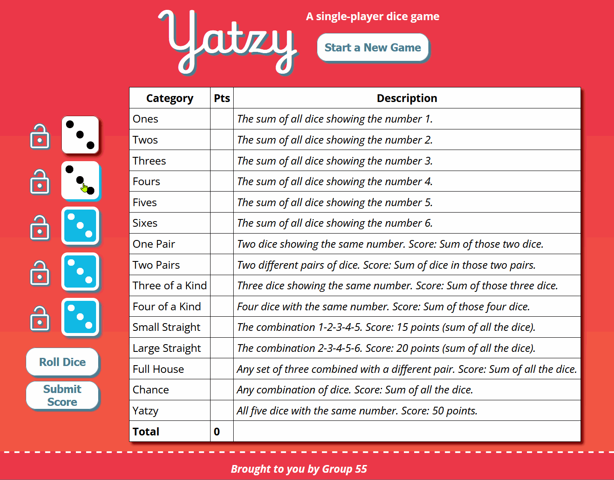

# Yatzy

## About the Game

This implementation of Yatzy is a single-player five dice game. To read about the design choices made while developing this implementation, please see our [Design System](docs/design_sytem.md) markdown file.

## Requirements

Before getting started, ensure you have the following installed and properly configured on your device (PATH, environment variables, etc).

- [php](https://www.php.net/manual/en/install.php)
- [composer](https://getcomposer.org/)

## How to Run

Clone or download the project repository and open cmd/terminal in the directory. Run ```composer install``` to install project dependencies.

After this is complete, change directory with the following commands in the terminal to launch a pHp web server on a local port.

```cmd
cd public 
php -S localhost:4000
```

If you see a message like this...

```cmd
[Thu Jul 18 22:48:39 2024] PHP 8.2.12 Development Server (http://localhost:4000) started
```

You can now view **Yatzy** at http://localhost:4000/!

## How to Play

### The Rules

- A game of Yatzy has **15 turns**, one for each score category on the scoring card.
- The player has **five dice**, which they may **re-roll** up to two extra times per turn.
- Players choose which dice to re-roll by **locking** dice to preserve their values.
- The player must **select** at least one die and exactly one scoring category per turn.
- When all categories have been filled in, the game ends.
- Players may choose to fill in the score categories in any order, but each category can only be filled in once.
- Players recieve a bonus if the total score in the first 6 categories is equal to or greater than 63.

### The Game Board

The game has the following layout.



- The **Start a New Game** button initializes a new game when clicked, erasing any previous data.
- The **scoreboard** (large table) allows the user to keep track of their scores by filling in the **Pts** column each turn.
- The **dice hand** is found to the **left** of the **scoreboard**. When a game has just started, no dice have been rolled.
- To the left of the dice is the **lock roster**. Each lock button toggles the lock state of their adjacent die.
- Below the dice and locks is the **Roll Dice** button. This button enables the rolling (and re-rolling) of dice when clicked while enabled.
- The **Submit Score** button is used to **end a turn** after a combination of **dice** and a s**core category** in the scoreboard have **both** been selected.

### Playing the Game

Click on the **Start a New Game** button.


Click the **Roll Dice** button after it activates



Consider which dice you would like to keep in order to maximize your score. Note: It may be of use to consult the **scoreboard** for its explanations of how points are calculated for each category.

If the values are underwhelming, use the **lock roster** to choose which values to keep, and then click the **Roll Dice** button up to two extra times.



If the values are desirable (or when out of re-rolls), click the dice to select them for scoring.


Select a category on the **scoreboard** by **clicking** a row with the cursor to choose what you would like to submit your score for. **Note that some categories require a specific number of dice!** Submitting an incorrect number of dice for categories requiring a specific number of dice will **result in a score of 0** for that category.



Continue this process and complete the scoreboard, aiming for the maximum number of points.



When the final turn has been completed, a pop-up will appear prompting you for your name. Input your name to submit your score to the leaderboard!


## Scoring Mechanics

Each hand of dice is stored as an array of numbers. For the game to calculate the score, this array is sorted and then parsed via **regular expressions** for most categories to determine if there is a match.

When there is no match, players can still submit a score, but the calculated points will be zero.
